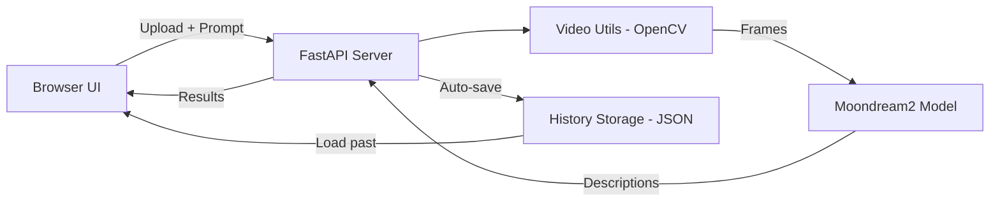

# Video Understanding Pipeline — Implementation Plan

AI-powered video analysis using Moondream2 vision-language model with FastAPI backend and browser UI.

## Architecture



## Components

---

### Backend Core

#### [MODIFY] [config.py](file:///c:/Users/91944/Downloads/3.Projects%20Portfolio/Projects/Video_Pipeline/app/config.py)
Device auto-detection (CUDA → MPS → CPU), file size limits, frame sampling config.

#### [MODIFY] [video_utils.py](file:///c:/Users/91944/Downloads/3.Projects%20Portfolio/Projects/Video_Pipeline/app/video_utils.py)
OpenCV-based frame extraction with resizing, validation, timestamp formatting.

#### [MODIFY] [model.py](file:///c:/Users/91944/Downloads/3.Projects%20Portfolio/Projects/Video_Pipeline/app/model.py)
Moondream2 singleton manager with:
- GPU float16 loading (tries CUDA first)
- VRAM check for low-VRAM GPUs (MX450 2GB)
- Automatic CPU fallback on OOM
- CUDA cache clearing between frames

#### [MODIFY] [main.py](file:///c:/Users/91944/Downloads/3.Projects%20Portfolio/Projects/Video_Pipeline/app/main.py)
FastAPI app with endpoints:
- `POST /api/analyze` — upload video + prompt → timestamped analysis (auto-saves to history)
- `GET /api/health` — system status, GPU info
- `GET /api/history` — list all saved analyses
- `GET /api/history/{id}` — get full analysis results
- `DELETE /api/history/{id}` — delete saved analysis

#### [NEW] [history.py](file:///c:/Users/91944/Downloads/3.Projects%20Portfolio/Projects/Video_Pipeline/app/history.py)
JSON file-based history storage. Each analysis saved as a separate file in `history/` directory.

---

### Frontend

#### [MODIFY] [index.html](file:///c:/Users/91944/Downloads/3.Projects%20Portfolio/Projects/Video_Pipeline/app/static/index.html)
Single-page UI with: video upload/webcam, prompt input, results display, and history panel.

#### [MODIFY] [styles.css](file:///c:/Users/91944/Downloads/3.Projects%20Portfolio/Projects/Video_Pipeline/app/static/styles.css)
Dark theme with glassmorphism, micro-animations, history cards.

---

### Extras

#### [NEW] [video_pipeline_colab.ipynb](file:///c:/Users/91944/Downloads/3.Projects%20Portfolio/Projects/Video_Pipeline/notebooks/video_pipeline_colab.ipynb)
Google Colab notebook for GPU inference with optional ngrok tunnel.

## Verification Plan

### Running Locally
```powershell
cd "c:\Users\91944\Downloads\3.Projects Portfolio\Projects\Video_Pipeline"
python -m uvicorn app.main:app --host 0.0.0.0 --port 8000
```

### Manual Verification
- Health check: `GET http://localhost:8000/api/health`
- History API: `GET http://localhost:8000/api/history`
- Upload video at `http://localhost:8000` and verify results appear + get saved to history
